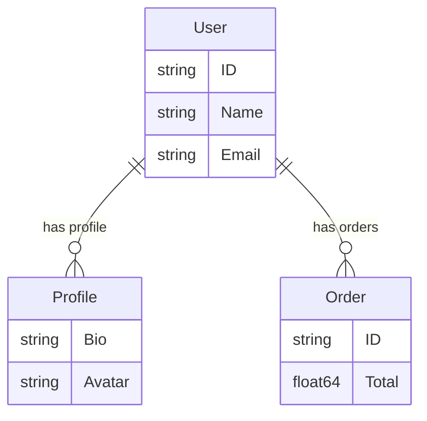

# sentinel

[](https://github.com/zoobzio/sentinel/actions/workflows/ci.yml)
[](https://codecov.io/gh/zoobzio/sentinel)
[](https://goreportcard.com/report/github.com/zoobzio/sentinel)
[](https://github.com/zoobzio/sentinel/security/code-scanning)
[](https://pkg.go.dev/github.com/zoobzio/sentinel)
[](LICENSE)
[](go.mod)
[](https://github.com/zoobzio/sentinel/releases)

Struct metadata extraction and relationship discovery for Go with zero dependencies.

Extract comprehensive metadata from your structs once, cache it permanently, and understand type relationships in your codebase.

## Core Features

Sentinel provides runtime struct introspection with:

- **Comprehensive metadata extraction** from struct fields and tags
- **Type relationship discovery** between structs in your domain
- **Permanent caching** for optimal performance
- **ERD generation** in Mermaid and GraphViz formats
- **Zero dependencies** - just the Go standard library

## Quick Start

```go
package main

import (
    "context"
    "fmt"
    "github.com/zoobzio/sentinel"
)

type User struct {
    ID      string   `json:"id" db:"user_id"`
    Name    string   `json:"name" validate:"required"`
    Email   string   `json:"email" validate:"email"`
    Profile *Profile `json:"profile"`
    Orders  []Order  `json:"orders"`
}

type Profile struct {
    Bio    string `json:"bio"`
    Avatar string `json:"avatar_url"`
}

type Order struct {
    ID     string  `json:"id"`
    Total  float64 `json:"total" validate:"gt=0"`
}

func main() {
    ctx := context.Background()
    
    // Extract metadata (cached after first call)
    metadata := sentinel.Inspect[User](ctx)
    
    fmt.Printf("Type: %s\n", metadata.TypeName)
    fmt.Printf("Package: %s\n", metadata.PackageName)
    fmt.Printf("Fields: %d\n", len(metadata.Fields))
    fmt.Printf("Relationships: %d\n", len(metadata.Relationships))
    
    // Discover relationships
    for _, rel := range metadata.Relationships {
        fmt.Printf("  %s -> %s (%s via field %s)\n",
            rel.From, rel.To, rel.Kind, rel.Field)
    }
}
```

## Metadata Extraction

Sentinel extracts comprehensive metadata from struct tags:

```go
type Product struct {
    ID          string  `json:"id" db:"product_id"`
    Name        string  `json:"name" validate:"required,max=100"`
    Price       float64 `json:"price" validate:"gt=0"`
    Description string  `json:"desc,omitempty" db:"description"`
    Tags        []Tag   `json:"tags"`
}

metadata := sentinel.Inspect[Product](ctx)

// Access field metadata
for _, field := range metadata.Fields {
    fmt.Printf("Field: %s (%s)\n", field.Name, field.Type)
    
    // Access all tags
    for tag, value := range field.Tags {
        fmt.Printf("  %s: %s\n", tag, value)
    }
}
```

## Relationship Discovery

Sentinel automatically discovers relationships between types in the same package:

```go
// GetRelationships returns all types this type references
relationships := sentinel.GetRelationships[User](ctx)

// GetReferencedBy returns all types that reference this type
referencedBy := sentinel.GetReferencedBy[Profile](ctx)

// Relationship types:
// - "reference": Direct struct field or pointer
// - "collection": Slice or array of structs
// - "embedding": Anonymous embedded struct
// - "map": Map with struct values
```

## ERD Generation

Generate Entity Relationship Diagrams from your types:

```go
// Generate Mermaid diagram from all cached types
mermaidDiagram := sentinel.GenerateERD(sentinel.ERDFormatMermaid)

// Generate DOT diagram for GraphViz
dotDiagram := sentinel.GenerateERD(sentinel.ERDFormatDOT)

// Generate diagram from specific root type (includes only reachable types)
userERD := sentinel.GenerateERDFromRoot[User](sentinel.ERDFormatMermaid)
```

Example Mermaid output:


## Custom Tag Registration

Register custom struct tags for extraction:

```go
// Register custom tags
sentinel.Tag(ctx, "custom")
sentinel.Tag(ctx, "myapp")

type Model struct {
    Field string `custom:"value" myapp:"metadata"`
}

// Custom tags are now extracted
metadata := sentinel.Inspect[Model](ctx)
// metadata.Fields[0].Tags["custom"] == "value"
// metadata.Fields[0].Tags["myapp"] == "metadata"
```

## Performance

Sentinel uses permanent caching - struct metadata is extracted once and cached forever (types don't change at runtime):

```go
// First call: extracts and caches metadata
metadata1 := sentinel.Inspect[User](ctx)  // ~microseconds

// Subsequent calls: returns from cache
metadata2 := sentinel.Inspect[User](ctx)  // ~nanoseconds
```

## Why sentinel?

- **Zero configuration**: No setup or registration required
- **Performance focused**: Permanent caching with minimal overhead
- **Type-safe**: Generic API prevents runtime type errors
- **Relationship aware**: Understands connections between your types
- **Visualization ready**: Generate ERDs for documentation
- **Zero dependencies**: No external packages required
- **Well tested**: 92%+ test coverage

## Installation

```bash
go get github.com/zoobzio/sentinel@latest
```

Requires Go 1.23 or later.

## API Reference

### Core Functions

```go
// Extract metadata for a type (cached permanently)
func Inspect[T any](ctx context.Context) ModelMetadata

// Register a custom struct tag for extraction
func Tag(ctx context.Context, tagName string)

// Get all cached type names
func Browse() []string

// Get cached metadata by type name
func GetCachedMetadata(typeName string) (ModelMetadata, bool)
```

### Relationship Functions

```go
// Get all relationships from a type
func GetRelationships[T any](ctx context.Context) []TypeRelationship

// Get all types that reference this type
func GetReferencedBy[T any](ctx context.Context) []TypeRelationship
```

### ERD Functions

```go
// Generate ERD from all cached types
func GenerateERD(format ERDFormat) string

// Generate ERD starting from a root type
func GenerateERDFromRoot[T any](format ERDFormat) string

// Get relationship graph data
func GetRelationshipGraph() map[string][]TypeRelationship
```

## Examples

### Extract validation rules

```go
type Form struct {
    Email    string `validate:"required,email"`
    Password string `validate:"required,min=8"`
    Age      int    `validate:"min=18,max=120"`
}

metadata := sentinel.Inspect[Form](ctx)
for _, field := range metadata.Fields {
    if rules, ok := field.Tags["validate"]; ok {
        fmt.Printf("%s: %s\n", field.Name, rules)
    }
}
```

### Database schema discovery

```go
type Model struct {
    ID        string `db:"id,primarykey"`
    CreatedAt time.Time `db:"created_at"`
    Name      string `db:"name,index"`
}

metadata := sentinel.Inspect[Model](ctx)
for _, field := range metadata.Fields {
    if dbTag, ok := field.Tags["db"]; ok {
        fmt.Printf("Column: %s -> %s\n", field.Name, dbTag)
    }
}
```

### Generate API documentation

```go
type APIRequest struct {
    UserID string `json:"user_id" example:"usr_123"`
    Action string `json:"action" enum:"create,update,delete"`
    Data   any    `json:"data,omitempty"`
}

metadata := sentinel.Inspect[APIRequest](ctx)
// Use metadata to generate OpenAPI specs, documentation, etc.
```

## Contributing

See [CONTRIBUTING.md](CONTRIBUTING.md) for guidelines.

## License

MIT License - see [LICENSE](LICENSE) for details.