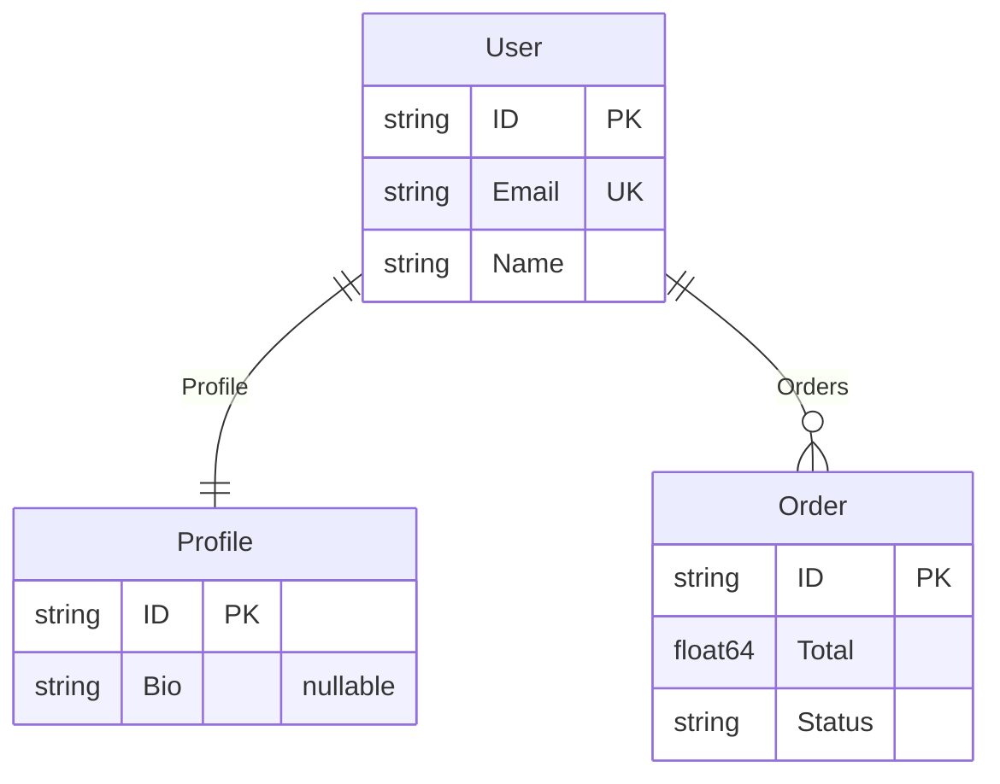

# sentinel

[](https://github.com/zoobzio/sentinel/actions/workflows/ci.yml)
[](https://codecov.io/gh/zoobzio/sentinel)
[](https://goreportcard.com/report/github.com/zoobzio/sentinel)
[](https://github.com/zoobzio/sentinel/security/code-scanning)
[](https://pkg.go.dev/github.com/zoobzio/sentinel)
[](LICENSE)
[](go.mod)
[](https://github.com/zoobzio/sentinel/releases)

Zero-dependency struct introspection for Go — extract metadata once, cache forever, and discover relationships between types.

## The Problem

Go's `reflect` package is powerful but verbose. Extracting field names, types, and struct tags requires boilerplate. Discovering relationships between types — which structs reference which — requires manual traversal. And you end up doing this work repeatedly, even though types never change at runtime.

## The Solution

Sentinel extracts struct metadata once, caches it permanently, and provides a clean API to access it:

```go
type User struct {
    ID      string   `json:"id" validate:"required"`
    Email   string   `json:"email" validate:"email"`
    Profile *Profile
    Orders  []Order
}

metadata := sentinel.Scan[User]()
```

You get:
- **Fields** — names, types, and all struct tags
- **Relationships** — `User` → `Profile` (reference), `User` → `Order` (collection)
- **Full type graph** — `Profile` and `Order` are cached too

No reflection boilerplate. No manual traversal. Cached forever.

## Features

- **Zero dependencies** — only the Go standard library
- **Permanent caching** — types are immutable at runtime, so metadata is cached once
- **Type-safe generics** — `Inspect[T]()` catches type errors at compile time
- **Relationship discovery** — automatically maps references, collections, embeddings, and maps
- **Module-aware scanning** — `Scan[T]()` recursively extracts all related types in your module
- **Thread-safe** — concurrent access after initial extraction

## Use Cases

- [Generate ERD diagrams](docs/4.cookbooks/1.erd-diagrams.md) from your domain models
- [Build structurally safe SQL queries](docs/4.cookbooks/2.database-schemas.md) (no injection by construction)
- [Auto-generate OpenAPI documentation](docs/4.cookbooks/3.api-documentation.md) from struct tags

## Install

```bash
go get github.com/zoobzio/sentinel@latest
```

Requires Go 1.23+.

## Quick Start

```go
// Define your types
type Order struct {
    ID     string  `json:"id" db:"order_id"`
    Total  float64 `json:"total" validate:"gte=0"`
    Status string  `json:"status"`
}

// Extract metadata
metadata := sentinel.Inspect[Order]()

// Access fields
for _, field := range metadata.Fields {
    fmt.Printf("%s (%s): %v\n", field.Name, field.Type, field.Tags)
}
// Output:
// ID (string): map[json:id db:order_id]
// Total (float64): map[json:total validate:gte=0]
// Status (string): map[json:status]

// Access relationships (if any)
for _, rel := range metadata.Relationships {
    fmt.Printf("%s -> %s (%s)\n", rel.From, rel.To, rel.Kind)
}
```

For types with relationships, use `Scan` to cache the entire type graph:

```go
sentinel.Scan[User]()           // Caches User, Profile, Order, and their relationships
schema := sentinel.Schema()     // Returns all cached metadata
```

## API Reference

| Function | Purpose |
|----------|---------|
| `Inspect[T]()` | Extract metadata for a single type |
| `Scan[T]()` | Extract type and all related types in module |
| `TryInspect[T]()` | Like Inspect, returns error instead of panic |
| `TryScan[T]()` | Like Scan, returns error instead of panic |
| `Tag(name)` | Register a custom struct tag for extraction |
| `Browse()` | List all cached type names |
| `Lookup(name)` | Get cached metadata by type name |
| `Schema()` | Export all cached metadata |
| `Reset()` | Clear cache (for testing) |
| `GetRelationships[T]()` | Get types that T references |
| `GetReferencedBy[T]()` | Get types that reference T |

## Relationship Discovery

Sentinel automatically discovers how your types connect:

```go
sentinel.Scan[User]()

// What does User reference?
sentinel.GetRelationships[User]()  // → Profile (reference), Order (collection)

// What references Order?
sentinel.GetReferencedBy[Order]()  // → User
```

Combined with [erd](https://github.com/zoobzio/erd), this metadata generates diagrams directly from your types:



## Design

Sentinel uses global state by design. Go's type system is fixed at compile time — a struct's fields and tags cannot change while the program runs. This means:

- One type system = one metadata cache
- No cache invalidation needed
- Thread-safe access after initial extraction

Go does not permit methods with type parameters, so functions like `Inspect[T]()` must be package-level.

See [Design Philosophy](docs/1.overview.md#design-philosophy) for details.

## Documentation

- [Overview](docs/1.overview.md) — what sentinel does and why
- **Learn**
  - [Quickstart](docs/2.learn/1.quickstart.md) — get started in 5 minutes
  - [Concepts](docs/2.learn/2.concepts.md) — metadata, relationships, caching
- **Guides**
  - [Scanning](docs/3.guides/1.scanning.md) — Inspect vs Scan, module boundaries
  - [Tags](docs/3.guides/2.tags.md) — custom tag registration
  - [Testing](docs/3.guides/3.testing.md) — testing with sentinel
- **Cookbooks**
  - [ERD Diagrams](docs/4.cookbooks/1.erd-diagrams.md) — visualize domain models with erd
  - [SQL Injection Safety](docs/4.cookbooks/2.database-schemas.md) — structurally safe queries with cereal
  - [API Documentation](docs/4.cookbooks/3.api-documentation.md) — automatic OpenAPI generation with rocco
- **Reference**
  - [API](docs/5.reference/1.api.md) — complete function documentation
  - [Types](docs/5.reference/2.types.md) — Metadata, FieldMetadata, TypeRelationship

## Contributing

See [CONTRIBUTING.md](CONTRIBUTING.md) for guidelines.

## License

MIT License — see [LICENSE](LICENSE) for details.
