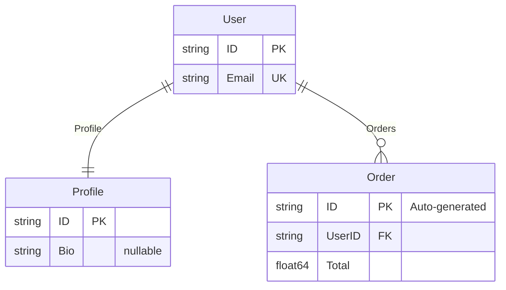

# Entity Relationship Diagrams (ERD)

## What is erd?

[erd](https://github.com/zoobzio/erd) generates Entity Relationship Diagrams from Go struct definitions.

Entity Relationship Diagrams visualize how domain types connect—which entities exist, what attributes they have, and how they relate to each other. They're useful for documentation, onboarding, and validating that your mental model matches the code.

erd outputs two formats:

- **Mermaid** — embeds in Markdown, renders in GitHub, documentation sites
- **GraphViz DOT** — print-quality diagrams, PDF export, detailed layouts

## How It Works

erd can build diagrams manually via a builder API, but the real power comes from automatic extraction. Point it at your domain model and it generates the diagram.

Define types with optional `erd` tags for key constraints:

```go
type User struct {
    ID      string   `erd:"pk"`
    Email   string   `erd:"uk"`
    Profile *Profile
    Orders  []Order
}

type Profile struct {
    ID  string `erd:"pk"`
    Bio *string
}

type Order struct {
    ID     string  `erd:"pk,note:Auto-generated"`
    UserID string  `erd:"fk"`
    Total  float64
}
```

Scan your domain and export the schema:

```go
sentinel.Scan[User]()
schema := sentinel.Schema()
```

Convert to a diagram:

```go
diagram := erd.FromSchema("Domain Model", schema)

// For markdown/web
fmt.Println(diagram.ToMermaid())

// For print/PDF
fmt.Println(diagram.ToDOT())
```



Relationships and cardinality are inferred automatically—no manual wiring.

## What Sentinel Provides

| erd needs     | Sentinel provides                            |
| ------------- | -------------------------------------------- |
| Entity names  | `Metadata.TypeName`                          |
| Attributes    | `FieldMetadata.Name`, `FieldMetadata.Type`   |
| Nullability   | `FieldMetadata.Kind` — pointers are nullable |
| Key markers   | `FieldMetadata.Tags["erd"]`                  |
| Relationships | `TypeRelationship` with `From`, `To`, `Kind` |
| Cardinality   | `TypeRelationship.Kind` maps to ERD notation |

## Tag Reference

| Tag      | Purpose        | Example                          |
| -------- | -------------- | -------------------------------- |
| `pk`     | Primary key    | `erd:"pk"`                       |
| `fk`     | Foreign key    | `erd:"fk"`                       |
| `uk`     | Unique key     | `erd:"uk"`                       |
| `note:x` | Add annotation | `erd:"note:Auto-generated UUID"` |

Tags can be combined: `erd:"pk,note:Auto-generated"`

## Cardinality Mapping

Sentinel's relationship kinds map directly to ERD notation:

| Relationship Kind | Go Type          | Diagram Notation |
| ----------------- | ---------------- | ---------------- |
| `reference`       | `*Profile`       | `||--||` 1:1 |
| `collection`      | `[]Order`        | `||--o{` 1:N   |
| `embedding`       | `BaseModel`      | `||--||` 1:1 |
| `map`             | `map[string]Tag` | `}o--o{` M:N     |

## Learn More

- [erd repository](https://github.com/zoobzio/erd)
