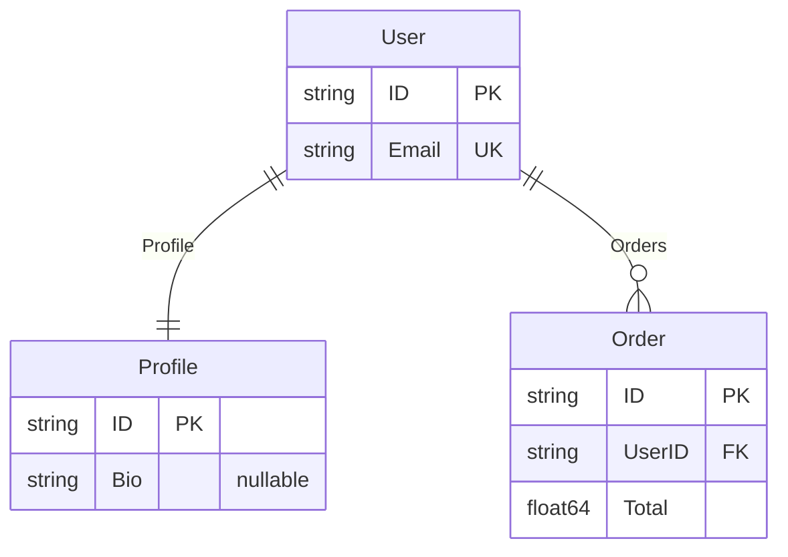

# erd

Generates Entity Relationship Diagrams from Go struct definitions.

## The Pipeline

Define types:

```go
type User struct {
    ID      string   `erd:"pk"`
    Email   string   `erd:"uk"`
    Profile *Profile
    Orders  []Order
}

type Profile struct {
    ID  string `erd:"pk"`
    Bio *string
}

type Order struct {
    ID     string  `erd:"pk"`
    UserID string  `erd:"fk"`
    Total  float64
}
```

Sentinel extracts the metadata:

```go
sentinel.Scan[User]()
schema := sentinel.Schema()

// schema["main.User"].Fields contains:
// - {Name: "ID", Type: "string", Kind: "scalar", Tags: {"erd": "pk"}}
// - {Name: "Email", Type: "string", Kind: "scalar", Tags: {"erd": "uk"}}
// - {Name: "Profile", Type: "*Profile", Kind: "pointer"}
// - {Name: "Orders", Type: "[]Order", Kind: "slice"}

// schema["main.User"].Relationships contains:
// - {From: "User", To: "Profile", Field: "Profile", Kind: "reference"}
// - {From: "User", To: "Order", Field: "Orders", Kind: "collection"}
```

erd transforms it to a diagram:

```go
diagram := erd.FromSchema("Domain Model", schema)
fmt.Println(diagram.ToMermaid())
```



## What Sentinel Provides

| erd needs     | Sentinel provides                            |
| ------------- | -------------------------------------------- |
| Entity names  | `Metadata.TypeName`                          |
| Attributes    | `FieldMetadata.Name`, `FieldMetadata.Type`   |
| Nullability   | `FieldMetadata.Kind` — pointers are nullable |
| Key markers   | `FieldMetadata.Tags["erd"]`                  |
| Relationships | `TypeRelationship` with `From`, `To`, `Kind` |
| Cardinality   | `TypeRelationship.Kind` maps to ERD notation |

## Cardinality Mapping

| Relationship Kind | Diagram Notation          | Example          |
| ----------------- | ------------------------- | ---------------- |
| `reference`       | `\|\|--\|\|` (one-to-one) | `*Profile`       |
| `collection`      | `\|\|--o{` (one-to-many)  | `[]Order`        |
| `embedding`       | `\|\|--\|\|` (one-to-one) | embedded struct  |
| `map`             | `}o--o{` (many-to-many)   | `map[string]Tag` |

## Learn More

- [erd repository](https://github.com/zoobzio/erd)
