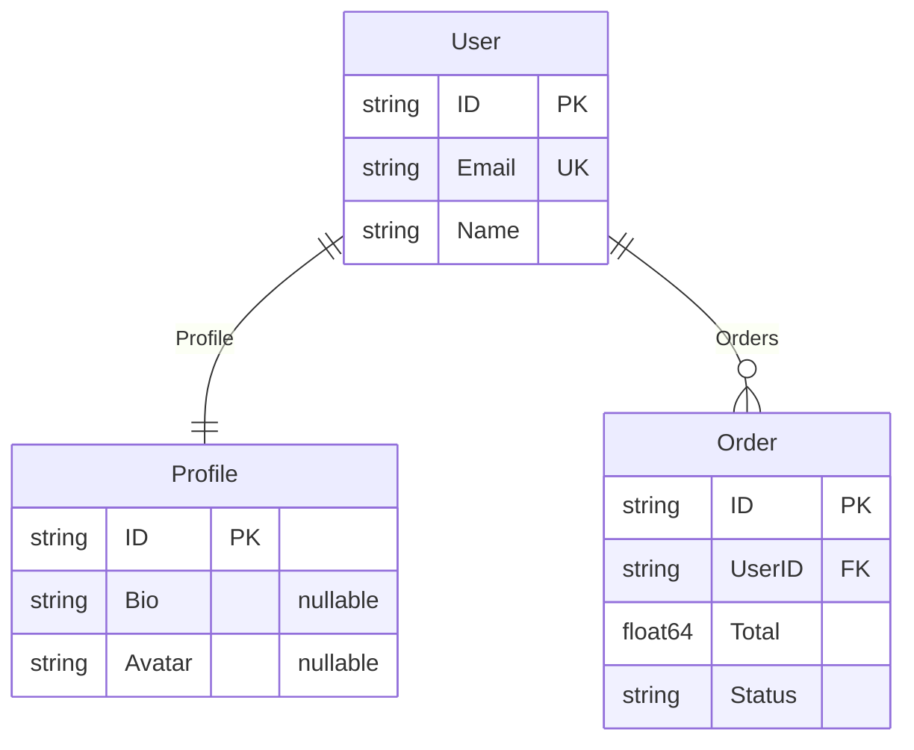

# ERD Diagrams

Visualize your Go domain models as Entity Relationship Diagrams using sentinel and [erd](https://github.com/zoobzio/erd).

## The Result

Define your domain:

```go
type User struct {
    ID      string   `erd:"pk"`
    Email   string   `erd:"uk"`
    Name    string
    Profile *Profile
    Orders  []Order
}

type Profile struct {
    ID     string `erd:"pk"`
    Bio    *string
    Avatar *string
}

type Order struct {
    ID     string  `erd:"pk"`
    UserID string  `erd:"fk"`
    Total  float64
    Status string
}
```

Get this:



## Usage

```go
sentinel.Scan[User]()
diagram := erd.FromSchema("Domain Model", sentinel.Schema())
fmt.Println(diagram.ToMermaid())
```

Three lines. Sentinel extracts your type graph; erd renders it.

## The `erd` Tag

Mark key constraints with the `erd` struct tag:

| Value | Meaning |
|-------|---------|
| `pk` | Primary key |
| `fk` | Foreign key |
| `uk` | Unique key |
| `note:...` | Attribute note |

```go
ID     string `erd:"pk"`
Email  string `erd:"uk"`
UserID string `erd:"fk"`
Avatar string `erd:"pk,note:Profile picture URL"`
```

Without tags, you still get a valid diagram — just without key markers.

## Automatic Detection

Sentinel provides everything else:

- **Entity names** — from `TypeName`
- **Attributes** — from `Fields` (excluding relationship fields)
- **Nullability** — pointer types (`*string`) are nullable
- **Relationships** — from `TypeRelationship`
- **Cardinality** — from relationship `Kind`:

| Field Type | Cardinality |
|------------|-------------|
| `*Profile` | One-to-One |
| `[]Order` | One-to-Many |
| `Address` (embedded) | One-to-One |
| `map[string]Tag` | Many-to-Many |

## Output Formats

```go
diagram.ToMermaid()  // GitHub, documentation, wikis
diagram.ToDOT()      // GraphViz, custom rendering
```

## See Also

- [erd](https://github.com/zoobzio/erd) — diagram builder and renderer
- [Scanning guide](../3.guides/1.scanning.md) — how relationship discovery works
